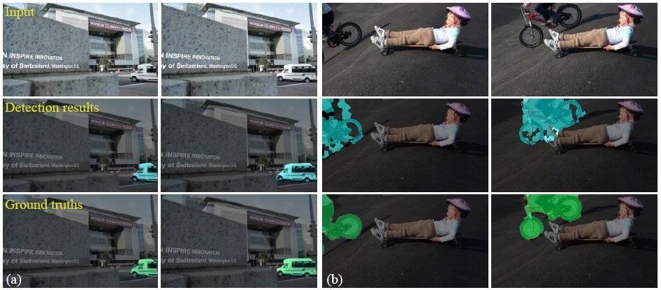

## Full Publications

 

<table class="paper-list">
  <tr>
    <td></td>
    <td>
		
Deep Portrait Image Completion and Extrapolation.
  
		
 Xian Wu, <b>Ruilong Li</b>, Fang-Lue Zhang, Jian-Cheng Liu, Jue Wang, Ariel Shamir, Shi-Min Hu.

		
IEEE Transactions on Image Processing (TIP, accepted with major revision)

		

			<a href="projects/PortraitCompletion/files/1808.07757.pdf" target="_blank" rel="noopener">
				<i class="fa fa-file-pdf-o" aria-hidden="true"></i> PDF </a>  
			<a href="https://arxiv.org/abs/1808.07757" target="_blank" rel="noopener">
				<i class="fa fa-file" aria-hidden="true"></i> arXiv </a>  
			<a href="projects/PortraitCompletion/index.html" target="_blank" rel="noopener">
				<i class="fa fa-link" aria-hidden="true"></i> ProjectPage </a> 
		

	</td>
  </tr>
</table>

<table class="paper-list">
  <tr>
    <td></td>
    <td>
		
PortraitNet: Real-time Portrait Segmentation Network for Mobile Device.

		
 Song-Hai Zhang, Xin Dong, Jia Li, <b>Ruilong Li</b>, Yong-Liang Yang.

		
Computers &amp; Graphics 2019 

		

			<a href="projects/MobilePortrait/cag.pdf" target="_blank" rel="noopener">
				<i class="fa fa-file-pdf-o" aria-hidden="true"></i> PDF </a>  
			<a href="https://github.com/dong-x16/PortraitNet" target="_blank" rel="noopener">
				<i class="fa fa-github" aria-hidden="true"></i> Code </a>  
			<!-- <a href="" target="_blank" rel="noopener">
				<i class="fa fa-github" aria-hidden="true"></i> Slides </a> -->  
		

	</td>
  </tr>
</table>

<table class="paper-list">
  <tr>
    <td></td>
    <td>
		
Pose2Seg: Detection Free Human Instance Segmentation.
  
		
 Song-Hai Zhang, <b>Ruilong Li*</b>, Xin Dong, Paul Rosin, Zixi Cai, Xi Han, Dingcheng Yang, Haozhi Huang, Shi-Min Hu. (*first student author)

		
IEEE Conference on Computer Vision and Pattern Recognition (CVPR, 2019)

		

			<a href="projects/pose2seg/files/Camera_Ready.pdf" target="_blank" rel="noopener">
				<i class="fa fa-file-pdf-o" aria-hidden="true"></i> PDF </a>
			<a href="https://arxiv.org/abs/1803.10683" target="_blank" rel="noopener">
				<i class="fa fa-file" aria-hidden="true"></i> arXiv </a> 
			<a href="projects/pose2seg/index.html" target="_blank" rel="noopener">
				<i class="fa fa-link" aria-hidden="true"></i> ProjectPage </a>  
			<a href="https://github.com/liruilong940607/Pose2Seg" target="_blank" rel="noopener">
				<i class="fa fa-github" aria-hidden="true"></i> Code </a>  
				<!-- <iframe style="margin-left: 2px; margin-bottom:-5px;" 
					frameborder="0" scrolling="0" width="100px" height="20px"
	                src="https://ghbtns.com/github-btn.html?user=liruilong940607&repo=Pose2Seg&type=star&count=true" >
	        	</iframe> -->
			<a href="https://github.com/liruilong940607/OCHumanApi" target="_blank" rel="noopener">
				<i class="fa fa-github" aria-hidden="true"></i> Dataset </a> 
				<!-- <iframe style="margin-left: 2px; margin-bottom:-5px;" 
					frameborder="0" scrolling="0" width="100px" height="20px"
	                src="https://ghbtns.com/github-btn.html?user=liruilong940607&repo=OCHumanApi&type=star&count=true" >
	        	</iframe> -->
	        <a href="projects/pose2seg/videos/pose2seg.mp4" target="_blank" rel="noopener">
				<i class="fa fa-file-video-o" aria-hidden="true"></i> Video </a>  
		

	</td>
  </tr>
</table>

<table class="paper-list">
  <tr>
    <td></td>
    <td>
		
Example-Guided Style-Consistent Image Synthesis from Semantic Labeling.
  
		
 Miao Wang, Guo-Ye Yang, <b>Ruilong Li</b>, Run-Ze Liang, Song-Hai Zhang, Peter M. Hall, Shi-Min Hu.

		
IEEE Conference on Computer Vision and Pattern Recognition (CVPR, 2019)

		

			<a href="projects/GuidedPix2Pix/files/CVPR_1135_Camera_ready.pdf" target="_blank" rel="noopener">
				<i class="fa fa-file-pdf-o" aria-hidden="true"></i> PDF </a>  
			<a href="projects/GuidedPix2Pix/index.html" target="_blank" rel="noopener">
				<i class="fa fa-link" aria-hidden="true"></i> ProjectPage </a> 
			<a href="projects/GuidedPix2Pix/files/CVPR_1135_supplementary.pdf" target="_blank" rel="noopener">
				<i class="fa fa-file-pdf-o" aria-hidden="true"></i> Supplementary </a>  
		

	</td>
  </tr>
</table>

<table class="paper-list">
  <tr>
    <td></td>
    <td>
		
Detecting and Removing Visual Distractors for Video Aesthetic Enhancement.

		
 Fang-Lue Zhang, Xian Wu, <b>Ruilong Li</b>, Jue Wang, Zhao-Heng Zheng, Shi-Min Hu.

		
IEEE Transactions on Multimedia (TMM, 2018)

		

			<a href="https://cg.cs.tsinghua.edu.cn/papers/TMM-2017-VideoDistractor.pdf" target="_blank" rel="noopener">
				<i class="fa fa-file-pdf-o" aria-hidden="true"></i> PDF </a>  
			<a href="http://cg.cs.tsinghua.edu.cn/figures/TMM-2017-VideoDistractor-1.wmv" target="_blank" rel="noopener">
				<i class="fa fa-file-video-o" aria-hidden="true"></i> Video1 </a>  
			<a href="http://cg.cs.tsinghua.edu.cn/figures/TMM-2017-VideoDistractor-2.wmv" target="_blank" rel="noopener">
				<i class="fa fa-file-video-o" aria-hidden="true"></i> Video2 </a>  
		

	</td>
  </tr>
</table>

<table class="paper-list">
  <tr>
    <td></td>
    <td>
		
Fast Portrait Automatic Segmentation with Coarse-to-Fine CNNs.

		
Xijin Zhang, <b>Ruilong Li</b>, Song-Hai Zhang.

		
Computer Aided Drafting Design &amp; Manufacturing, 2017 

		

			<a href="projects/MobilePortrait/files/Fast_Portrait_Automatic_Segmentation_with_Coarse-to-Fine_CNNs.pdf" target="_blank" rel="noopener">
				<i class="fa fa-file-pdf-o" aria-hidden="true"></i> PDF </a>  
			<a href="projects/MobilePortrait/files/siggraph_asia_2017_ppt_humanseg.pptx" target="_blank" rel="noopener">
				<i class="fa fa-github" aria-hidden="true"></i> Slides </a>  
		

	</td>
  </tr>
</table>

